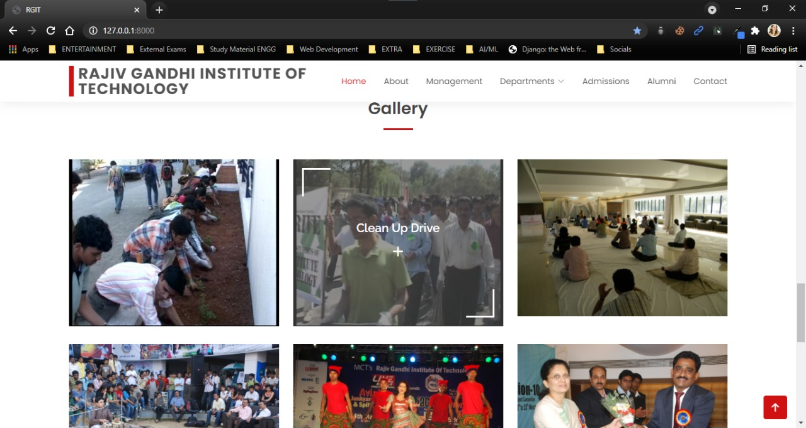
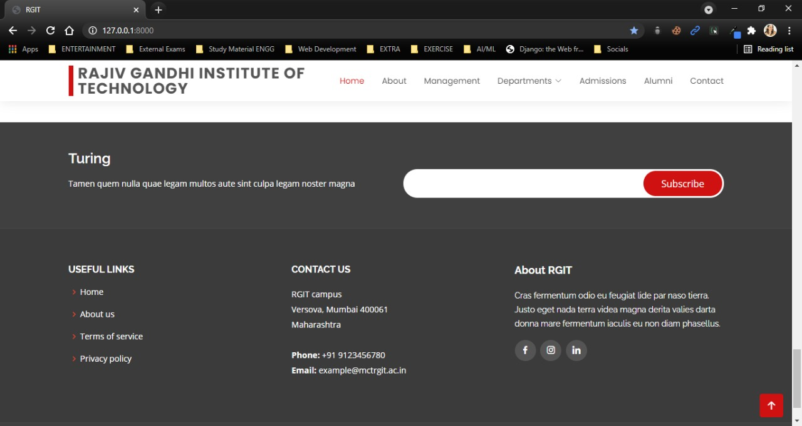
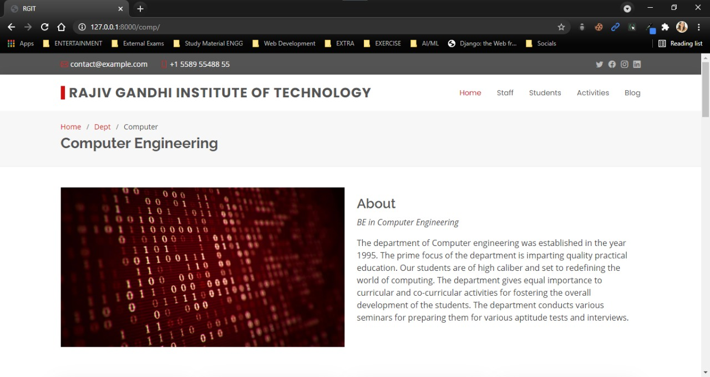
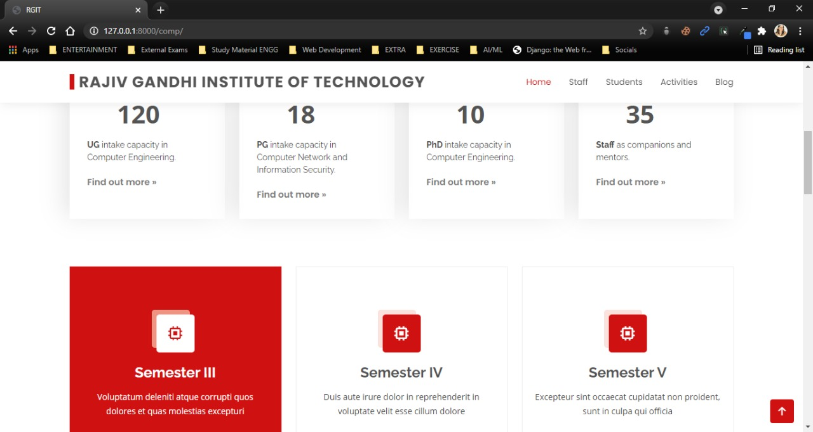
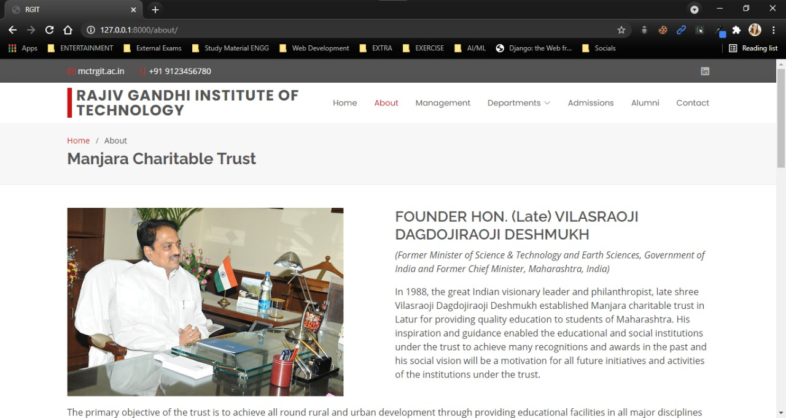

# Rajiv Gandhi Institute of Technology

## Contributing

### Setting-up the project

- Download and install Python
- Download and install Git.
- Fork the Repository.
- Clone the repository to your local machine `$ git clone https://github.com/<your-github-username>/RGITwebapp.git`
- Change directory to JagratiWebApp `$ cd RGITwebapp`
- Install virtualenv `$ pip3 install virtualenv`
- Create a virtual environment `$ virtualenv env -p python`
- Activate the env: `$ source env/bin/activate` (for linux) `> .\env\Scripts\activate` (for Windows PowerShell)
- Make migrations `$ python manage.py makemigrations`
- Migrate the changes to the database `$ python manage.py migrate`
- Create admin `$ python manage.py createsuperuser`
- Run the server `$ python manage.py runserver`

### Samples

